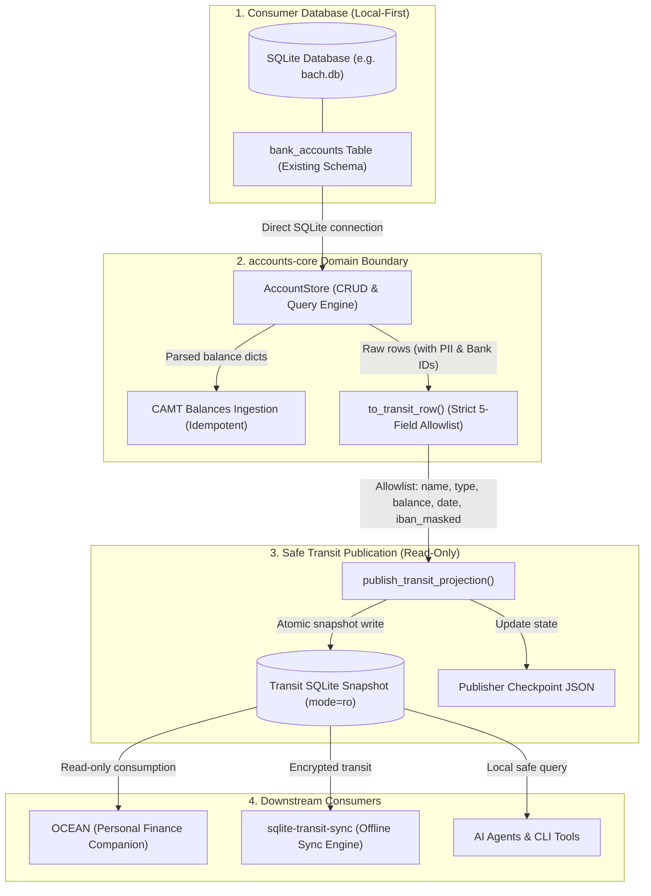
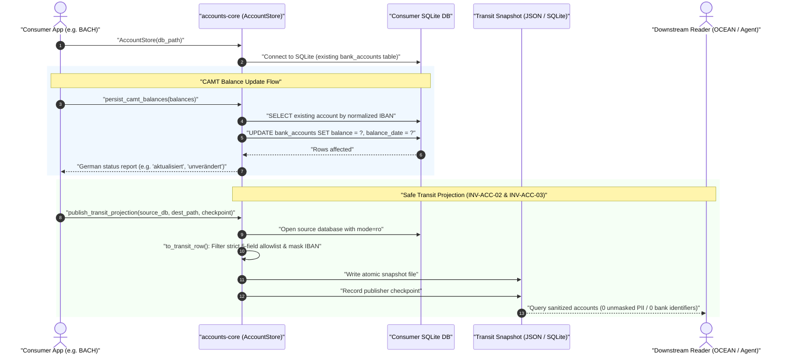

# accounts-core

[English](README.md) | [Deutsch](README_de.md)

<p align="center">
  <a href="pyproject.toml"></a>
  <a href="https://github.com/ellmos-ai/accounts-core/actions/workflows/ci.yml"></a>
  <a href="tests/"></a>
  <a href="pyproject.toml"></a>
  <a href="pyproject.toml"></a>
  <a href="SECURITY.md"></a>
  <a href="SECURITY.md"></a>
  <a href="https://github.com/astral-sh/ruff"></a>
  <a href="https://github.com/ellmos-ai"></a>
  <a href="https://github.com/open-bricks"></a>
  <a href="MARKETING-LOG.txt"></a>
  <a href="llms.txt"></a>
  <a href="LICENSE"></a>
</p>

Neutral domain core for the account/bank-balance domain. Wave 1 ships bank account CRUD,
CAMT balance import, and a **privacy-safe read-only transit projection** for other consumers
(e.g. OCEAN).

Extracted from [BACH](https://github.com/ellmos-ai/bach) so that BACH and OCEAN read the same
account data through one implementation instead of BACH owning a second, drifting copy
(decision D-20260903-003 = A, analysis `KONTEN-DOMAENE-OCEAN-ANALYSE_2026-09-03.md`). Same wave-1
pattern as [assistant-core](https://github.com/ellmos-ai/assistant-core) (D-20260830-002).

## Table of Contents

- [Visual Architecture](#visual-architecture)
- [Sequence Lifecycle](#sequence-lifecycle)
- [Contract](#contract)
- [Privacy: the transit projection is an allowlist, not a denylist](#privacy-the-transit-projection-is-an-allowlist-not-a-denylist)
- [Governance & System Invariants](#governance--system-invariants)
- [Install](#install)
- [Usage](#usage)
- [Ecosystem & Sister Repositories](#ecosystem--sister-repositories)
- [Privacy (module boundary)](#privacy-module-boundary)
- [Project structure](#project-structure)
- [Development](#development)
- [License](#license)

## Visual Architecture



## Sequence Lifecycle



## Contract

- **One data canon.** `AccountStore` is handed the consumer's SQLite path (BACH: `bach.db`) and
  works on the existing `bank_accounts` table. It creates no tables and keeps no data of its own.
- **No UI toolkit, no HTTP, no XML parsing.** Consumers wire endpoints against this API and hand
  `persist_camt_balances` already-parsed balance dicts (the shape BACH's `CamtParser.parse_balances()`
  returns) -- the CAMT file format stays a BACH-side concern.
- **Behaviour identical to BACH.** Every SQL statement is the one BACH ran before the extraction;
  only the call site moved.
- **`credits` (Kredite) is out of wave 1.** A related but separate domain per the analysis; add it
  in a later wave if a consumer needs it.

## Privacy: the transit projection is an allowlist, not a denylist

`AccountStore.transit_projection()` returns **only** `name`, `account_type`, `balance`,
`balance_date`, and `iban_masked` (last 4 characters, the rest replaced by `*`). No account
number, no BIC, no bank name, no holder name, no notes -- and, critically, **no field that gets
added to `bank_accounts` later leaks through by accident**: `to_transit_row()` builds the result
by naming the five allowed fields explicitly, never by removing keys from the source row. A
denylist forgets the next column someone adds; an allowlist cannot. See
`test_to_transit_row_drops_bank_identifiers_and_unknown_columns` for the regression test.

## Governance & System Invariants

The `accounts-core` package enforces 8 architectural invariants:

| Invariant | Title | Specification & Safety Guarantee |
|---|---|---|
| `INV-ACC-01` | Zero Database Ownership | `AccountStore` creates no tables and manages no migrations; operates exclusively on the consumer's existing SQLite `bank_accounts` table. |
| `INV-ACC-02` | Strict Allowlist Transit Projection | Transit projection exports exactly 5 fields: `name`, `account_type`, `balance`, `balance_date`, `iban_masked`. Built by inclusion, eliminating leakage risks. |
| `INV-ACC-03` | Masked IBAN Guarantee | Unmasked IBAN strings never leave the core boundary in transit projections; masked to last 4 characters (`****3000`). |
| `INV-ACC-04` | Pure Local-First & Zero Egress | Zero external network calls, zero sockets, zero telemetry. 100% pure standard library execution in user-mode (`RunAsInvoker`). |
| `INV-ACC-05` | Immutable Source Isolation | Source SQLite databases are opened with explicit `mode=ro` during publishing. Source, destination, and checkpoint must be 3 distinct paths. |
| `INV-ACC-06` | Atomic Snapshot Publishing | Snapshots are staged to a temporary file and atomically renamed to prevent tearing or partial reads by downstream consumers. |
| `INV-ACC-07` | Idempotent CAMT Balance Ingestion | Balances are matched strictly by normalized IBAN; yields deterministic UTF-8 German status responses (`aktualisiert`, `unverändert`). |
| `INV-ACC-08` | Deterministic Fail-Closed Error Handling | Typed exceptions (`FileNotFoundError`, `ValueError`) are raised on invalid paths or schema violations; never silently falls through. |

## Install

```bash
pip install -e .            # in the consumer's environment
pip install -e ".[dev]"     # plus pytest and ruff
```

Python 3.10+, no runtime dependencies.

## Usage

```python
from accounts_core import AccountStore

store = AccountStore("/path/to/bach.db")          # or default_db_path() -> BACH_DB env
account_id = store.create_account("Girokonto", bank_name="Sparkasse", iban="DE89...", bic="...")
store.list_accounts()
store.update_account(account_id, "Neuer Name", bank_name="Sparkasse")
store.delete_account(account_id)

# CAMT import: hand it already-parsed balances (BACH's CamtParser.parse_balances() shape)
store.persist_camt_balances([{"iban": "DE89...", "balance": 1234.56, "currency": "EUR", "date": "2026-09-01"}])

# Read-only projection for other consumers (OCEAN via sqlite-transit-sync, wave 3)
store.transit_projection()
# -> [{"name": "Girokonto", "account_type": "girokonto", "balance": 1234.56,
#      "balance_date": "2026-09-01", "iban_masked": "*"*18 + "3000"}]
```

Wave 3 publishes that same allowlist as a separate, closed SQLite file for
`sqlite-transit-sync` and OCEAN. The source database is opened read-only; the
source, projection, and publisher checkpoint must be three distinct paths.

```python
from accounts_core import publish_transit_projection

publish_transit_projection(
    "/path/to/bach.db",
    "/path/to/transit/accounts.sqlite",
    "/path/to/state/accounts-publisher.json",
    publisher_instance="bach-primary",
)
```

The output implements `org.ellmos.accounts.balance-projection` v1.0.0. It is a
complete replacement snapshot: consumers verify it, then replace their prior
read-only view. No source id or unmasked bank identifier is written.

`persist_camt_balances()` returns UTF-8 German result messages with genuine umlauts, such as
`unverändert` and `übersprungen`.

## Ecosystem & Sister Repositories

`accounts-core` is a central domain building block within the `ellmos-ai` and `open-bricks` ecosystem:

| Repository | Role in Ecosystem | Integration Point |
|---|---|---|
| [bach](https://github.com/ellmos-ai/bach) | Primary Financial Monolith / Consumer | Source of bank account records (`bach.db`), CAMT ingestion trigger |
| [sqlite-transit-sync](https://github.com/ellmos-ai/sqlite-transit-sync) | Offline SQLite Sync Engine | Transports read-only account snapshots between hosts |
| [assistant-core](https://github.com/ellmos-ai/assistant-core) | Domain Core for LLM Assistant State | Companion core module sharing architectural wave-1 pattern |
| [open-ocean](https://github.com/ellmos-ai/open-ocean) | Local Personal Finance & Budget Companion | Downstream consumer reading privacy-safe account snapshots |
| [report-forge](https://github.com/ellmos-ai/report-forge) | Deterministic Reporting Engine | Generates account statements & reports from snapshots |
| [open-bricks](https://github.com/open-bricks) | Umbrella Open Source Initiative | Architectural governance, standards, and packaging |

## Privacy (module boundary)

Works only on the database path it is given. No network, no telemetry, no files of its own.
Bank stammdaten (account number, BIC, holder name) never leave the module through the transit
projection -- see the allowlist section above.

## Project structure

```
src/accounts_core/accounts.py    AccountStore, transit projection, CAMT balance persistence
src/accounts_core/__init__.py    Public module exports and package version
tests/test_accounts.py           behaviour against the exact BACH bank_accounts DDL
tests/test_metadata.py           contract tests for metadata, security SLAs, CI and parity
MARKETING-LOG.txt                personas, discoverability keywords, and integration blueprints
THIRD_PARTY_LICENSES.md         pure stdlib zero-runtime-dependency inventory (PEP 639)
TODO.md                          standardized task tracker with STATUS table & release gates
SECURITY.md                      bilingual security policy with 48h response SLA & 5d triage
llms.txt                         machine-readable LLM context document
ellmos-module.v2.json            module manifest for the ellmos module catalog
```

## Development

```bash
pytest -ra -v
python -m ruff check src tests
python -m compileall -q src tests
```

## License

MIT. See [LICENSE](LICENSE) and [THIRD_PARTY_LICENSES.md](THIRD_PARTY_LICENSES.md). Canonical repository: `ellmos-ai/accounts-core` (private).
