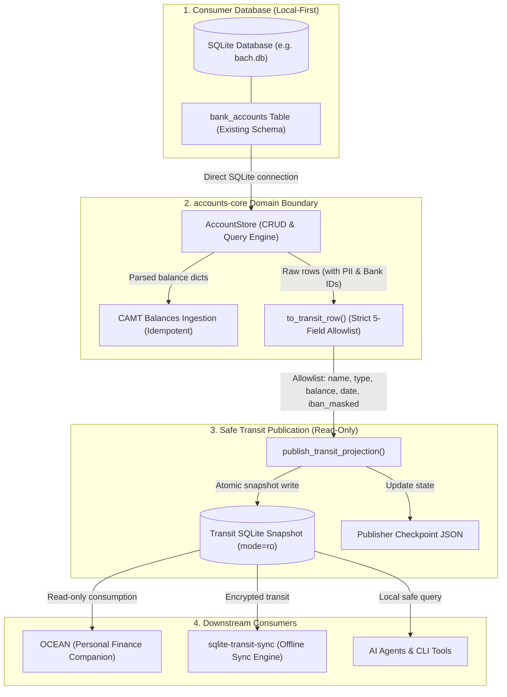
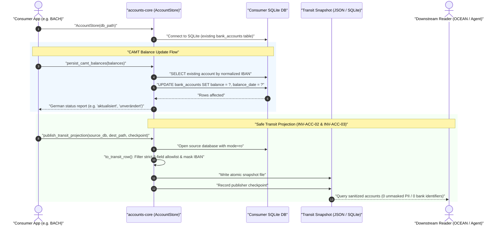

# accounts-core

[English](README.md) | [Deutsch](README_de.md)

<p align="center">
  <a href="pyproject.toml"></a>
  <a href="https://github.com/ellmos-ai/accounts-core/actions/workflows/ci.yml"></a>
  <a href="tests/"></a>
  <a href="pyproject.toml"></a>
  <a href="pyproject.toml"></a>
  <a href="SECURITY.md"></a>
  <a href="SECURITY.md"></a>
  <a href="https://github.com/astral-sh/ruff"></a>
  <a href="https://github.com/ellmos-ai"></a>
  <a href="https://github.com/open-bricks"></a>
  <a href="llms.txt"></a>
  <a href="NOTICE"></a>
  <a href="THIRD_PARTY_LICENSES.txt"></a>
  <a href="THIRD_PARTY_LICENSES.txt"></a>
  <a href="CHANGELOG.md"></a>
  <a href="LICENSE"></a>
</p>

Neutral domain core for the account and bank-balance domain. Wave 1 ships bank account CRUD,
CAMT balance import, and a **privacy-safe read-only transit projection** for downstream
consumers (e.g. OCEAN).

Extracted from [BACH](https://github.com/ellmos-ai/bach) so that BACH and OCEAN read the same
account data through one implementation instead of BACH owning a second, drifting copy
(decision D-20260903-003 = A, analysis `KONTEN-DOMAENE-OCEAN-ANALYSE_2026-09-03.md`). Same wave-1
pattern as [assistant-core](https://github.com/ellmos-ai/assistant-core) (D-20260830-002).

## Table of Contents

- [1. Key Features](#key-features)
- [2. Visual Architecture](#visual-architecture)
- [3. Sequence Lifecycle](#sequence-lifecycle)
- [4. Target Personas & Discoverability](#target-personas--discoverability)
- [5. Comparative Matrix vs. Alternatives](#comparative-matrix--alternatives)
- [6. Contract & Domain Boundaries](#contract--domain-boundaries)
- [7. Privacy: Strict Allowlist Projection](#privacy-allowlist-projection)
- [8. Governance & Runtime Invariants](#governance--runtime-invariants)
- [9. Installation](#installation)
- [10. Quickstart & Usage Guide](#quickstart--usage-guide)
- [11. CAMT Balance Ingestion](#camt-balance-ingestion)
- [12. Safe Transit Publisher Specification](#transit-publisher-specification)
- [13. Sibling Tools & Ecosystem](#sibling-tools--ecosystem)
- [14. Third-Party Licenses & Transparency](#third-party-licenses--transparency)
- [15. Repository Structure](#repository-structure)
- [16. Development & Test Matrix](#development--test-matrix)
- [17. Security Policy & Contact](#security-policy--contact)
- [18. Statutory Notice & Liability Limitation](#statutory-notice--liability-limitation)

---

<a id="sec-01"></a><a id="key-features"></a>
## Key Features

- **Single Data Canon:** Operates directly on the consumer's SQLite database (`bank_accounts` table); creates no tables and manages no migrations.
- **Idempotent CAMT Balance Ingestion:** Consumes pre-parsed balance dictionaries, updates balances by normalized IBAN, and returns deterministic German status reports (`aktualisiert`, `unverändert`).
- **Strict Allowlist Transit Projection:** Projects exactly 5 sanitized fields (`name`, `account_type`, `balance`, `balance_date`, `iban_masked`), eliminating data leakage risks by construction.
- **Guaranteed IBAN Masking:** Bank identifiers (account number, BIC, bank name, holder name) never leave the core boundary; IBAN strings are masked to the last 4 characters.
- **100% Local-First & Zero Egress:** Zero external network calls, zero sockets, zero telemetry. Pure standard library execution in user space (`RunAsInvoker`).
- **Immutable Source Isolation:** Source database is opened with explicit `mode=ro` during publishing; source, projection, and checkpoint paths must remain strictly distinct.

---

<a id="sec-02"></a><a id="visual-architecture"></a>
## Visual Architecture



### ASCII Architectural Topology (Four-View Projection)

```text
========================================================================================
                      accounts-core: Four-View Architectural Topology
========================================================================================

[VIEW 1: CONSUMER DATA CANON & LOCAL-FIRST STORAGE]
  +----------------------------------------------------------------------------------+
  | Consumer SQLite Database (e.g., bach.db, var/data/finance.db)                    |
  | - Table: bank_accounts (existing consumer schema; accounts-core creates 0 tables)|
  | - Zero Migration Footprint: adapts dynamically to existing columns               |
  | - Multi-OS Compatibility: Windows NTFS, Linux ext4/tmpfs, macOS APFS             |
  +----------------------------------------------------------------------------------+
                                           |
                                           | (Direct unprivileged stdlib sqlite3 connection)
                                           v
[VIEW 2: DOMAIN ENGINE CORE & IDEMPOTENT BALANCE INGESTION]
  +----------------------------------------------------------------------------------+
  | AccountStore (CRUD & Account Lifecycle Engine)                                   |
  | - create_account(), list_accounts(), update_account(), delete_account()          |
  | - normalize_iban(): deterministic whitespace, punctuation & casing stripping     |
  | - persist_camt_balances(): idempotent balance updates via CAMT.052 / CAMT.053    |
  |   Returns deterministic German status feedback: 'aktualisiert', 'unverändert'    |
  +----------------------------------------------------------------------------------+
                                           |
                                           | (Raw row transformation via strict inclusion)
                                           v
[VIEW 3: DATA MINIMIZATION & ALLOWLIST TRANSIT PROJECTION]
  +----------------------------------------------------------------------------------+
  | to_transit_row() / transit_projection() (Strict 5-Field Allowlist Boundary)      |
  | - Explicit Fields: name, account_type, balance, balance_date, iban_masked        |
  | - Guaranteed IBAN Masking: ****3000 (last 4 characters preserved, rest masked)   |
  | - Zero PII / Bank ID Leakage: BIC, bank name, account number, notes excluded     |
  | - Non-Extensible Allowlist: new database columns cannot leak through             |
  +----------------------------------------------------------------------------------+
                                           |
                                           | (Staged temporary file & atomic filesystem rename)
                                           v
[VIEW 4: DOWNSTREAM CONSUMPTION & ZERO-EGRESS SECURITY PERIMETER]
  +----------------------------------------------------------------------------------+
  | publish_transit_projection() -> Closed Read-Only SQLite Snapshot (mode=ro)       |
  | - Consumer: OCEAN (Personal Finance Companion)                                   |
  | - Transport: sqlite-transit-sync (Encrypted offline peer sync)                   |
  | - Integration: Autonomous AI Agents (Claude, Codex, Antigravity) & CLI Tools     |
  | - Perimeter: 100% Local-First, Zero Egress, RunAsInvoker unprivileged execution  |
  +----------------------------------------------------------------------------------+
========================================================================================
```

---

<a id="sec-03"></a><a id="sequence-lifecycle"></a>
## Sequence Lifecycle



---

<a id="sec-04"></a><a id="target-personas--discoverability"></a>
## Target Personas & Discoverability

| Persona ID | Target Audience | Primary Needs & Operational Pain Points | High-Intent Discoverability Queries |
| :--- | :--- | :--- | :--- |
| `[PERSONA-01]` | **FinTech & Local Accounting Engineers** | Lightweight, robust domain primitives for bank accounts, checking accounts, credit cards, IBAN normalization, and balance tracking without heavy ORMs. | `python bank account library local sqlite`, `camt balance import python zero dependencies`, `iban normalization python stdlib` |
| `[PERSONA-02]` | **Privacy-by-Design & Local-First Architects** | Sharing account information with UI components, caching layers, or external services without leaking sensitive PII or full account identifiers. | `privacy-safe bank balance projection`, `masked iban transit projection sqlite`, `local-first financial data minimization` |
| `[PERSONA-03]` | **Multi-Source Banking Data Integrators** | Ingesting bank balance updates from CAMT XML files (camt.052, camt.053) without duplicate records or destructive overwrites. | `idempotent camt balance update sqlite`, `camt 053 balance parser python`, `iso 20022 account balance persistence` |
| `[PERSONA-04]` | **Autonomous AI Agent & Tool Integrators** | Safe, predictable primitives for agentic systems (Claude Code, Codex, Antigravity, MCP servers) to query financial balances with deterministic error handling and zero risk of network egress or data corruption. | `mcp bank account tools local first`, `ai agent financial balance tool zero egress`, `deterministic offline accounting python` |

---

<a id="sec-05"></a><a id="comparative-matrix--alternatives"></a>
## Comparative Matrix vs. Alternatives

| Architectural Dimension | `accounts-core` (This Module) | Direct Raw SQLite Ad-Hoc Scripts | Heavyweight ERP / Accounting Frameworks (Odoo / Tryton) | Cloud Banking / Open Banking SaaS APIs (Plaid / Tink) | Invariant Alignment |
| :--- | :--- | :--- | :--- | :--- | :--- |
| **Schema Ownership** | Zero ownership; adapts to existing consumer table | Uncontrolled ad-hoc table mutations | Monolithic proprietary DB schema migrations | Cloud-hosted proprietary schemas | `INV-ACC-01` |
| **PII & IBAN Protection** | Strict 5-field allowlist & guaranteed IBAN masking | Leaks full IBAN, BIC, and account numbers | Complex denylists with high leakage risk | Complete financial PII transmitted to cloud | `INV-ACC-02`, `INV-ACC-03` |
| **Network Perimeter** | 100% Local-First, zero network egress | Local script, but lacks perimeter guards | Requires daemon, network services | Mandatory internet connection & telemetry | `INV-ACC-04` |
| **Source Isolation** | Opened with explicit `mode=ro` during publishing | Shared read-write locks prone to corruption | Shared write transactions across processes | Remote server manages isolation | `INV-ACC-05` |
| **Snapshot Publishing** | Atomic staging & filesystem rename | Vulnerable to torn reads and partial writes | Heavyweight database export / backup | Webhook or polling race conditions | `INV-ACC-06` |
| **CAMT Update Semantics** | Idempotent matching by normalized IBAN | Fragile custom parsing, duplicate risks | Complex stateful accounting importers | Provider-dependent transaction sync | `INV-ACC-07` |
| **Error Handling** | Typed standard library exceptions | Ad-hoc string errors and silent failures | Complex framework-specific exception trees | HTTP status codes & network error modes | `INV-ACC-08` |
| **Privilege Model** | `RunAsInvoker` (unprivileged user space) | Uncontrolled script execution | Often requires background daemon / service | Requires API keys and cloud credentials | `INV-ACC-09` |
| **Runtime Dependencies** | Zero external dependencies (100% stdlib) | Variable / uncontrolled pip dependencies | Massive dependency tree (hundreds of packages) | Heavy vendor SDKs and HTTP clients | `INV-ACC-04` |
| **Security Governance** | Formal 48h SLA & public advisory workflow | No formal security governance or audit trail | Vendor-dependent commercial SLA | Commercial cloud SLA | `INV-ACC-10` |

---

<a id="sec-06"></a><a id="contract--domain-boundaries"></a>
## Contract & Domain Boundaries

- **One data canon:** `AccountStore` is handed the consumer's SQLite path (BACH: `bach.db`) and
  works on the existing `bank_accounts` table. It creates no tables and keeps no data of its own.
- **No UI toolkit, no HTTP, no XML parsing:** Consumers wire endpoints against this API and hand
  `persist_camt_balances` already-parsed balance dicts (the shape BACH's `CamtParser.parse_balances()`
  returns) -- the CAMT file format stays a BACH-side concern.
- **Behaviour identical to BACH:** Every SQL statement is the one BACH ran before the extraction;
  only the call site moved.
- **`credits` (Kredite) is out of wave 1:** A related but separate domain per the analysis; add it
  in a later wave if a consumer needs it.

---

<a id="sec-07"></a><a id="privacy-allowlist-projection"></a>
## Privacy: Strict Allowlist Projection

`AccountStore.transit_projection()` returns **only** `name`, `account_type`, `balance`,
`balance_date`, and `iban_masked` (last 4 characters, the rest replaced by `*`). No account
number, no BIC, no bank name, no holder name, no notes -- and, critically, **no field that gets
added to `bank_accounts` later leaks through by accident**: `to_transit_row()` builds the result
by naming the five allowed fields explicitly, never by removing keys from the source row. A
denylist forgets the next column someone adds; an allowlist cannot. See
`test_to_transit_row_drops_bank_identifiers_and_unknown_columns` for the regression test.

---

<a id="sec-08"></a><a id="governance--runtime-invariants"></a>
## Governance & Runtime Invariants

The `accounts-core` package enforces 10 architectural invariants:

| Invariant | Title | Specification & Safety Guarantee |
|---|---|---|
| `INV-ACC-01` | Zero Database Ownership | `AccountStore` creates no tables and manages no migrations; operates exclusively on the consumer's existing SQLite `bank_accounts` table. |
| `INV-ACC-02` | Strict Allowlist Transit Projection | Transit projection exports exactly 5 fields: `name`, `account_type`, `balance`, `balance_date`, `iban_masked`. Built by inclusion, eliminating leakage risks. |
| `INV-ACC-03` | Masked IBAN Guarantee | Unmasked IBAN strings never leave the core boundary in transit projections; masked to last 4 characters (`****3000`). |
| `INV-ACC-04` | Pure Local-First & Zero Egress | Zero external network calls, zero sockets, zero telemetry. 100% pure standard library execution in user-mode (`RunAsInvoker`). |
| `INV-ACC-05` | Immutable Source Isolation | Source SQLite databases are opened with explicit `mode=ro` during publishing. Source, destination, and checkpoint must be 3 distinct paths. |
| `INV-ACC-06` | Atomic Snapshot Publishing | Snapshots are staged to a temporary file and atomically renamed to prevent tearing or partial reads by downstream consumers. |
| `INV-ACC-07` | Idempotent CAMT Balance Ingestion | Balances are matched strictly by normalized IBAN; yields deterministic UTF-8 German status responses (`aktualisiert`, `unverändert`). |
| `INV-ACC-08` | Deterministic Fail-Closed Error Handling | Typed exceptions (`FileNotFoundError`, `ValueError`) are raised on invalid paths or schema violations; never silently falls through. |
| `INV-ACC-09` | Unprivileged User-Mode Non-Elevation | Operates under the `RunAsInvoker` security principle; requires zero administrative elevation or root privileges across all platforms. |
| `INV-ACC-10` | 48h Security Response & 5-Day Triage SLA | Formal vulnerability response within 48 hours and triage resolution within 5 business days per `SECURITY.md`. |

---

<a id="sec-09"></a><a id="installation"></a>
## Installation

```bash
pip install -e .            # in the consumer's environment
pip install -e ".[dev]"     # plus pytest and ruff
```

Python 3.10+, zero runtime dependencies.

---

<a id="sec-10"></a><a id="quickstart--usage-guide"></a>
## Quickstart & Usage Guide

```python
from accounts_core import AccountStore

store = AccountStore("/path/to/bach.db")          # or default_db_path() -> BACH_DB env
account_id = store.create_account("Girokonto", bank_name="Sparkasse", iban="DE89370400440532013000", bic="SPKADE...")
store.list_accounts()
store.update_account(account_id, "Neuer Name", bank_name="Sparkasse")
store.delete_account(account_id)

# CAMT import: hand it already-parsed balances (BACH's CamtParser.parse_balances() shape)
store.persist_camt_balances([{"iban": "DE89370400440532013000", "balance": 1234.56, "currency": "EUR", "date": "2026-09-01"}])

# Read-only projection for other consumers (OCEAN via sqlite-transit-sync, wave 3)
projection = store.transit_projection()
# -> [{"name": "Girokonto", "account_type": "girokonto", "balance": 1234.56,
#      "balance_date": "2026-09-01", "iban_masked": "****************3000"}]
```

---

<a id="sec-11"></a><a id="camt-balance-ingestion"></a>
## CAMT Balance Ingestion

Consumers parse CAMT statements (e.g. CAMT.052, CAMT.053) into raw dictionary structures and pass them
to `persist_camt_balances()`:

```python
from accounts_core import AccountStore

store = AccountStore("var/data/finance.db")
camt_data = [
    {
        "iban": "DE89370400440532013000",
        "balance": 5420.50,
        "currency": "EUR",
        "date": "2026-09-15",
    }
]

status_report = store.persist_camt_balances(camt_data)
# Returns genuine UTF-8 status messages:
# [{'iban': 'DE89370400440532013000', 'status': 'aktualisiert', 'balance': 5420.5}]
```

---

<a id="sec-12"></a><a id="transit-publisher-specification"></a>
## Safe Transit Publisher Specification

Wave 3 publishes the allowlisted projection as an isolated, closed SQLite database for
`sqlite-transit-sync` and OCEAN. The source database is opened read-only; the
source, projection, and publisher checkpoint must be three distinct paths.

```python
from accounts_core import publish_transit_projection

publish_transit_projection(
    "/path/to/bach.db",
    "/path/to/transit/accounts.sqlite",
    "/path/to/state/accounts-publisher.json",
    publisher_instance="bach-primary",
)
```

The output implements `org.ellmos.accounts.balance-projection` v1.0.0. It is a
complete replacement snapshot: consumers verify it, then replace their prior
read-only view. No source id or unmasked bank identifier is written.

---

<a id="sec-13"></a><a id="sibling-tools--ecosystem"></a>
## Sibling Tools & Ecosystem

`accounts-core` is a central domain building block within the `ellmos-ai` and `open-bricks` ecosystem:

| Repository | Role in Ecosystem | Integration Point |
|---|---|---|
| [bach](https://github.com/ellmos-ai/bach) | Primary Financial Monolith / Consumer | Source of bank account records (`bach.db`), CAMT ingestion trigger |
| [sqlite-transit-sync](https://github.com/ellmos-ai/sqlite-transit-sync) | Offline SQLite Sync Engine | Transports read-only account snapshots between hosts |
| [assistant-core](https://github.com/ellmos-ai/assistant-core) | Domain Core for LLM Assistant State | Companion core module sharing architectural wave-1 pattern |
| [open-ocean](https://github.com/ellmos-ai/open-ocean) | Local Personal Finance & Budget Companion | Downstream consumer reading privacy-safe account snapshots |
| [report-forge](https://github.com/ellmos-ai/report-forge) | Deterministic Reporting Engine | Generates account statements & reports from snapshots |
| [open-bricks](https://github.com/open-bricks) | Umbrella Open Source Initiative | Architectural governance, standards, and packaging |

---

<a id="sec-14"></a><a id="third-party-licenses--transparency"></a>
## Third-Party Licenses & Transparency

`accounts-core` maintains a Level 1 Software Bill of Materials (SBOM) with zero external runtime dependencies:

- **Runtime Dependencies:** 100% pure Python standard library under PSF License 2.0 (`sqlite3`, `pathlib`, `typing`, `dataclasses`, `logging`, `os`, `sys`, `re`, `datetime`). Zero external wheels or packages.
- **Copyleft Isolation:** 100% MIT licensed code with zero AGPL/GPL contamination.
- **RunAsInvoker Certification:** Operates strictly within unprivileged user space without administrative elevation.
- **Plain-Text Companion:** Complete inventory, Invariant Cross-Reference Matrix, and license texts are published in [THIRD_PARTY_LICENSES.txt](THIRD_PARTY_LICENSES.txt).
- For complete attributions, see [THIRD_PARTY_LICENSES.md](THIRD_PARTY_LICENSES.md) and [THIRD_PARTY_LICENSES.txt](THIRD_PARTY_LICENSES.txt).

---

<a id="sec-15"></a><a id="repository-structure"></a>
## Repository Structure

```
accounts-core/
├── src/
│   └── accounts_core/
│       ├── __init__.py            # Public module exports and package version
│       ├── accounts.py            # AccountStore, transit projection, CAMT balance persistence
│       └── transit_publisher.py   # Atomic read-only transit snapshot publisher
├── tests/
│   ├── test_accounts.py           # Domain tests against exact BACH bank_accounts schema
│   ├── test_metadata.py           # Contract tests for navigation, personas, matrix, SLAs, SBOM
│   └── test_transit_publisher.py  # Publisher snapshot and checkpoint verification
├── .github/
│   ├── workflows/
│   │   ├── auto-assign.yml        # Auto-assignment workflow for pull requests
│   │   ├── ci.yml                 # Multi-OS test matrix (Ubuntu, Windows, macOS x Python 3.10-3.13)
│   │   ├── label-sync.yml         # Label synchronization workflow
│   │   ├── stale.yml              # Automated issue and PR lifecycle management
│   │   └── welcome.yml            # Welcome greeting for first-time contributors
│   └── labels.yml                 # Standard governance labels definition
├── CHANGELOG.md                   # Chronological version history and release notes
├── CONTRIBUTING.md                # Contribution guidelines, RunAsInvoker, and quality gates
├── LICENSE                        # MIT License
├── NOTICE                         # Attribution and open-bricks umbrella relations
├── README.md                      # English documentation with 18-point quick navigation
├── README_de.md                   # German documentation with 18-point quick navigation
├── SECURITY.md                    # Security policy with 48h response and 5-day triage SLA
├── THIRD_PARTY_LICENSES.md        # Level 1 SBOM and pure stdlib dependency inventory
├── THIRD_PARTY_LICENSES.txt       # Canonical plain-text Level 1 SBOM companion
├── TODO.md                        # Task tracker with STATUS table and release gates
├── ellmos-module.v2.json          # Module manifest for ellmos catalog
├── llms.txt                       # Machine-readable LLM context document
└── pyproject.toml                 # PEP 621 package metadata and ecosystem configuration
```

---

<a id="sec-16"></a><a id="development--test-matrix"></a>
## Development & Test Matrix

```bash
pytest -ra -v
python -m ruff check src tests
python -m compileall -q src tests
```

---

<a id="sec-17"></a><a id="security-policy--contact"></a>
## Security Policy & Contact

We take security and data privacy seriously:

- **Response SLA:** Vulnerability disclosures receive initial response within **48 hours**.
- **Triage Commitment:** Triage and mitigation timeline confirmed within **5 business days**.
- **Security Contacts:**
  - `security@open-bricks.org`
  - `security@ellmos.ai`
  - `support@lukasgeiger.com`
  - `lukas@open-bricks.org`
- **Private Advisory:** Disclosures can be submitted via [GitHub Security Advisories](https://github.com/ellmos-ai/accounts-core/security/advisories/new).

---

<a id="sec-18"></a><a id="statutory-notice--liability-limitation"></a>
## Statutory Notice & Liability Limitation

This software is provided free of charge under the MIT License as open-source software. Under German statutory law (§ 521 BGB - *Gefälligkeitsrecht* / gratuitous contracts), liability in the case of gratuitous provision of software is limited to intent (*Vorsatz*) and gross negligence (*grobe Fahrlässigkeit*). In particular, no warranties are provided for fitness for a particular purpose or absence of defects.
