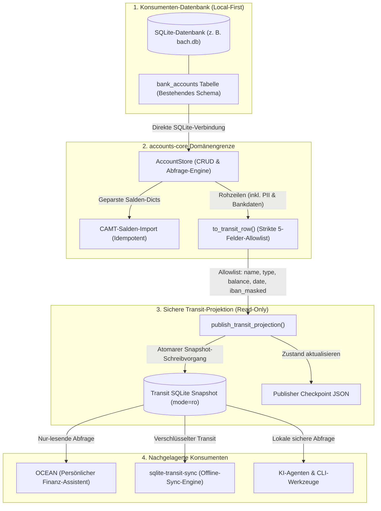

# accounts-core

[English](README.md) | [Deutsch](README_de.md)

<p align="center">
  <a href="pyproject.toml"></a>
  <a href="https://github.com/ellmos-ai/accounts-core/actions/workflows/ci.yml"></a>
  <a href="tests/"></a>
  <a href="pyproject.toml"></a>
  <a href="pyproject.toml"></a>
  <a href="SECURITY.md"></a>
  <a href="SECURITY.md"></a>
  <a href="https://github.com/astral-sh/ruff"></a>
  <a href="https://github.com/ellmos-ai"></a>
  <a href="https://github.com/open-bricks"></a>
  <a href="MARKETING-LOG.txt"></a>
  <a href="llms.txt"></a>
  <a href="LICENSE"></a>
</p>

Neutraler Fachkern für die Konten- und Kontostand-Domäne. Welle 1 liefert Bankkonten-CRUD,
CAMT-Salden-Import und eine **privacy-sichere, read-only Transit-Projektion** für nachgelagerte
Konsumenten (z. B. OCEAN).

Aus [BACH](https://github.com/ellmos-ai/bach) extrahiert, damit BACH und OCEAN dieselben
Kontodaten über eine Implementierung lesen, statt dass BACH eine zweite, auseinanderdriftende
Kopie hält (Entscheidung D-20260903-003 = A, Analyse
`KONTEN-DOMAENE-OCEAN-ANALYSE_2026-09-03.md`). Gleiches Welle-1-Muster wie
[assistant-core](https://github.com/ellmos-ai/assistant-core) (D-20260830-002).

## Inhaltsverzeichnis

- [1. Hauptmerkmale](#hauptmerkmale)
- [2. Visuelle Architektur](#visuelle-architektur)
- [3. Sequenz-Lebenszyklus](#sequenz-lebenszyklus)
- [4. Zielgruppen & Auffindbarkeit](#zielgruppen--auffindbarkeit)
- [5. Vergleichsmatrix vs. Alternativen](#vergleichsmatrix--alternativen)
- [6. Vertrag & Domänengrenzen](#vertrag--domaenengrenzen)
- [7. Datenschutz: Strikte Allowlist-Projektion](#datenschutz-allowlist-projektion)
- [8. Governance & Laufzeit-Invarianten](#governance--laufzeit-invarianten)
- [9. Installation](#installation)
- [10. Schnellstart & Anwendungsbeispiele](#schnellstart--anwendungsbeispiele)
- [11. CAMT-Saldenverarbeitung](#camt-salden-verarbeitung)
- [12. Sichere Transit-Publisher-Spezifikation](#transit-publisher-spezifikation)
- [13. Geschwisterwerkzeuge & Ökosystem](#geschwisterwerkzeuge--oekosystem)
- [14. Drittanbieter-Lizenzen & Transparenz](#drittanbieter-lizenzen--transparenz)
- [15. Repository-Struktur](#repository-struktur)
- [16. Entwicklung & Testmatrix](#entwicklung--testmatrix)
- [17. Sicherheitsrichtlinie & Kontakt](#sicherheitsrichtlinie--kontakt)
- [18. Gesetzlicher Hinweis & Haftungsbeschränkung](#gesetzlicher-hinweis--haftungsbeschraenkung)

---

<a id="hauptmerkmale"></a>
## Hauptmerkmale

- **Einheitlicher Datenkanon:** Arbeitet direkt auf der bestehenden SQLite-Tabelle `bank_accounts` des Konsumenten; legt keine eigenen Tabellen an und verwaltet keine Migrationen.
- **Idempotenter CAMT-Saldenimport:** Verarbeitet vor-geparste Salden-Dictionaries, gleicht Konten über normalisierte IBANs ab und liefert deterministische deutsche Statusmeldungen (`aktualisiert`, `unverändert`).
- **Strikte Allowlist-Transitprojektion:** Exportiert exakt 5 bereinigte Felder (`name`, `account_type`, `balance`, `balance_date`, `iban_masked`) und schließt Datenlecks konstruktionsbedingt aus.
- **Garantierte IBAN-Maskierung:** Bank-Stammdaten (Kontonummer, BIC, Bankname, Kontoinhaber) verlassen niemals die Modulgrenze; IBANs werden auf die letzten 4 Zeichen maskiert.
- **100% Local-First & Zero Egress:** Keine Netzwerkaufrufe, keine Sockets, keine Telemetrie. Reine Ausführung über die Python-Standardbibliothek im Benutzermodus (`RunAsInvoker`).
- **Unveränderliche Quell-Isolation:** Quell-Datenbanken werden beim Publizieren explizit mit `mode=ro` geöffnet; Quelle, Projektion und Checkpoint müssen 3 disjunkte Pfade sein.

---

<a id="visuelle-architektur"></a>
## Visuelle Architektur



---

<a id="sequenz-lebenszyklus"></a>
## Sequenz-Lebenszyklus


---

<a id="zielgruppen--auffindbarkeit"></a>
## Zielgruppen & Auffindbarkeit

| Persona-ID | Zielgruppe | Primäre Anforderungen & Herausforderungen | Gezielte Suchbegriffe (High-Intent SEO) |
| :--- | :--- | :--- | :--- |
| `[PERSONA-01]` | **FinTech- & Buchhaltungs-Entwickler** | Schlanke, robuste Domänen-Grundbausteine für Bankkonten, Girokonten, Kreditkarten, IBAN-Normalisierung und Saldenverfolgung ohne ORM-Ballast. | `python bank account library local sqlite`, `camt balance import python zero dependencies`, `iban normalization python stdlib` |
| `[PERSONA-02]` | **Privacy-by-Design & Local-First Architekten** | Bereitstellung von Kontoinformationen für Benutzeroberflächen, Caches oder Partnersysteme ohne Weitergabe vertraulicher PII oder Bank-Stammdaten. | `privacy-safe bank balance projection`, `masked iban transit projection sqlite`, `local-first financial data minimization` |
| `[PERSONA-03]` | **CAMT-Bankdaten-Integratoren** | Einlesen von Saldenaktualisierungen aus CAMT-XML-Dateien (camt.052, camt.053) ohne Dubletten oder destruktives Überschreiben. | `idempotent camt balance update sqlite`, `camt 053 balance parser python`, `iso 20022 account balance persistence` |
| `[PERSONA-04]` | **Autonome KI-Agenten & Tool-Integratoren** | Sichere, deterministische Primitiven für Agentensysteme (Claude Code, Codex, Antigravity, MCP-Server) zur Kontostandsabfrage mit robuster Fehlerbehandlung und Zero-Egress. | `mcp bank account tools local first`, `ai agent financial balance tool zero egress`, `deterministic offline accounting python` |

---

<a id="vergleichsmatrix--alternativen"></a>
## Vergleichsmatrix vs. Alternativen

| Architektur-Dimension | `accounts-core` (Dieses Modul) | Direkte Ad-Hoc SQLite-Skripte | Schwergewichtige ERPs / Frameworks (Odoo / Tryton) | Cloud-Banking / Open-Banking SaaS APIs (Plaid / Tink) | Invarianten-Bezug |
| :--- | :--- | :--- | :--- | :--- | :--- |
| **Schema-Eigentümerschaft** | Keine Eigentümerschaft; nutzt bestehende Konsumententabelle | Unkontrollierte Schema-Modifikationen | Monolithische, proprietäre Datenbankschemata | Cloud-gehostete proprietäre Schemata | `INV-ACC-01` |
| **PII- & IBAN-Schutz** | Strikte 5-Felder-Allowlist & garantierte IBAN-Maskierung | Volle Exposition von IBAN, BIC und Kontonummern | Komplexe Denylists mit hohem Leckage-Risiko | Vollständige Übertragung aller Finanzdaten in die Cloud | `INV-ACC-02`, `INV-ACC-03` |
| **Netzwerkperimeter** | 100% Local-First, null Netzwerkaufrufe | Lokale Skripte, jedoch ohne Perimeter-Garantien | Benötigt Server-Dienste, Daemon-Prozesse | Zwingende Internetverbindung & Telemetrie | `INV-ACC-04` |
| **Quell-Isolation** | Expliziter `mode=ro` Lesezugriff beim Export | Geteilte Lese-Schreib-Sperren mit Korruptionsrisiko | Geteilte Schreibtransaktionen über Prozesse hinweg | Isolation liegt ausschließlich beim Cloud-Anbieter | `INV-ACC-05` |
| **Snapshot-Export** | Atomare Bereitstellung & Rename auf Dateisystemebene | Gefahr unvollständiger Lese- oder Schreibvorgänge | Aufwändige Datenbank-Dumps und Exporte | Webhook- oder Polling-Synchronisationskonflikte | `INV-ACC-06` |
| **CAMT-Aktualisierungslogik** | Idempotente Zuordnung über normalisierte IBAN | Fragile Ad-hoc-Skripte mit Dublettenrisiko | Komplexe zustandsbehaftete Buchungs-Importeure | Anbieterabhängige Transaktionssynchronisation | `INV-ACC-07` |
| **Fehlerbehandlung** | Typisierte Ausnahmen der Standardbibliothek | Unstrukturierte Zeichenketten-Fehler | Tief verschachtelte Framework-Ausnahmebäume | HTTP-Statuscodes & Netzwerk-Verbindungsfehler | `INV-ACC-08` |
| **Rechtemodell** | `RunAsInvoker` (unprivilegierter Benutzermodus) | Unkontrollierte Skriptausführung | Oft administrative Hintergrunddienste erforderlich | Erfordert API-Schlüssel und Cloud-Zugangsdaten | `INV-ACC-09` |
| **Laufzeit-Abhängigkeiten** | Null externe Abhängigkeiten (100% Python-Stdlib) | Variable / unkontrollierte Fremdpakete | Enorme Abhängigkeitsbäume (hunderte Pakete) | Umfangreiche Hersteller-SDKs und HTTP-Clients | `INV-ACC-04` |
| **Sicherheitsgovernance** | Formelle 48h-Reaktionszeit & Advisory-Prozess | Keine formelle Sicherheitsarchitektur | Abhängig vom kommerziellen Hersteller-Support | Abhängig von Cloud-SLA | `INV-ACC-10` |

---

<a id="vertrag--domaenengrenzen"></a>
## Vertrag & Domänengrenzen

- **Einheitlicher Datenkanon:** `AccountStore` erhält den SQLite-Pfad des Konsumenten (BACH: `bach.db`)
  und operiert auf der existierenden Tabelle `bank_accounts`. Es werden keine Tabellen angelegt und keine
  eigenen Datenbestände vorgehalten.
- **Kein UI-Toolkit, kein HTTP, kein XML-Parsing:** Konsumenten binden Endpunkte gegen diese API an und
  übergeben `persist_camt_balances` bereits geparste Salden-Dictionaries (entsprechend dem Rückgabeformat
  von BACHs `CamtParser.parse_balances()`) -- das CAMT-Dateiformat verbleibt auf Konsumentenseite.
- **Identisches Verhalten wie in BACH:** Jedes SQL-Statement entspricht exakt dem vor der Extraktion
  ausgeführten Code; lediglich der Aufrufumfang wurde modularisiert.
- **`credits` (Kredite) gehört nicht zu Welle 1:** Eine verwandte, aber eigenständige Domäne gemäß Analyse;
  eine Anbindung erfolgt bei Bedarf in einer späteren Phase.

---

<a id="datenschutz-allowlist-projektion"></a>
## Datenschutz: Strikte Allowlist-Projektion

`AccountStore.transit_projection()` liefert **ausschließlich** `name`, `account_type`, `balance`,
`balance_date` und `iban_masked` (die letzten 4 Zeichen sichtbar, der Rest durch `*` maskiert). Keine
Kontonummer, keine BIC, kein Bankname, kein Inhabername, keine Notizen -- und entscheidend: **kein
nachträglich zu `bank_accounts` hinzugefügtes Feld kann versehentlich nach außen dringen**:
`to_transit_row()` baut das Ergebnis ausschließlich durch explizite Nennung der fünf erlaubten Felder
auf, niemals durch Entfernen von Schlüsseln aus der Quellzeile. Eine Denylist vergisst die nächste
Spalte; eine Allowlist kann dies nicht.

---

<a id="governance--laufzeit-invarianten"></a>
## Governance & Laufzeit-Invarianten

Das Paket `accounts-core` erzwingt 10 architektonische Invarianten:

| Invariante | Bezeichnung | Spezifikation & Sicherheitsgarantie |
|---|---|---|
| `INV-ACC-01` | Zero Database Ownership | `AccountStore` legt keine Tabellen an und verwaltet keine Migrationen; arbeitet ausschließlich auf der bestehenden SQLite-Tabelle `bank_accounts`. |
| `INV-ACC-02` | Strict Allowlist Transit Projection | Die Transit-Projektion exportiert exakt 5 Felder: `name`, `account_type`, `balance`, `balance_date`, `iban_masked`. Konstruktionsbedingt lecksicher. |
| `INV-ACC-03` | Masked IBAN Guarantee | Unmaskierte IBAN-Strings verlassen die Modulgrenze bei Transit-Projektionen niemals; auf die letzten 4 Zeichen maskiert (`****3000`). |
| `INV-ACC-04` | Pure Local-First & Zero Egress | Keine Netzwerkaufrufe, keine Sockets, keine Telemetrie. Reine Ausführung über die Python-Standardbibliothek im Benutzermodus (`RunAsInvoker`). |
| `INV-ACC-05` | Immutable Source Isolation | Quell-Datenbanken werden beim Publizieren explizit mit `mode=ro` geöffnet. Quelle, Ziel und Checkpoint müssen 3 disjunkte Pfade sein. |
| `INV-ACC-06` | Atomic Snapshot Publishing | Snapshots werden über temporäre Dateien vorbereitet und atomar umbenannt, um unvollständige Lesevorgänge auszuschließen. |
| `INV-ACC-07` | Idempotent CAMT Balance Ingestion | Salden werden strikt über die normalisierte IBAN zugeordnet; liefert deterministische deutsche UTF-8 Rückmeldungen (`aktualisiert`, `unverändert`). |
| `INV-ACC-08` | Deterministic Fail-Closed Error Handling | Typisierte Ausnahmen (`FileNotFoundError`, `ValueError`) werden bei ungültigen Pfaden oder Schema-Verletzungen ausgelöst; kein stiller Abbruch. |
| `INV-ACC-09` | Unprivileged User-Mode Non-Elevation | Arbeitet streng nach dem `RunAsInvoker`-Prinzip; erfordert keinerlei Administrator- oder Root-Rechte auf allen Plattformen. |
| `INV-ACC-10` | 48h Security Response & 5-Day Triage SLA | Formelle Rückmeldung bei Sicherheitsmeldungen innerhalb von 48 Stunden und Triage-Abschluss innerhalb von 5 Werktagen gemäß `SECURITY.md`. |

---

<a id="installation"></a>
## Installation

```bash
pip install -e .            # in der Konsumenten-Umgebung
pip install -e ".[dev]"     # inklusive pytest und ruff
```

Python 3.10+, null Laufzeitabhängigkeiten.

---

<a id="schnellstart--anwendungsbeispiele"></a>
## Schnellstart & Anwendungsbeispiele

```python
from accounts_core import AccountStore

store = AccountStore("/pfad/zu/bach.db")          # oder default_db_path() -> BACH_DB env
account_id = store.create_account("Girokonto", bank_name="Sparkasse", iban="DE89370400440532013000", bic="SPKADE...")
store.list_accounts()
store.update_account(account_id, "Neuer Name", bank_name="Sparkasse")
store.delete_account(account_id)

# CAMT-Import: Übergabe vor-geparster Salden (Format von BACHs CamtParser.parse_balances())
store.persist_camt_balances([{"iban": "DE89370400440532013000", "balance": 1234.56, "currency": "EUR", "date": "2026-09-01"}])

# Nur-lesbare Projektion für nachgelagerte Konsumenten (OCEAN über sqlite-transit-sync)
projection = store.transit_projection()
# -> [{"name": "Girokonto", "account_type": "girokonto", "balance": 1234.56,
#      "balance_date": "2026-09-01", "iban_masked": "****************3000"}]
```

---

<a id="camt-salden-verarbeitung"></a>
## CAMT-Saldenverarbeitung

Konsumenten überführen CAMT-Auszüge (z. B. CAMT.052, CAMT.053) in Roh-Dictionaries und übergeben
diese an `persist_camt_balances()`:

```python
from accounts_core import AccountStore

store = AccountStore("var/data/finance.db")
camt_daten = [
    {
        "iban": "DE89370400440532013000",
        "balance": 5420.50,
        "currency": "EUR",
        "date": "2026-09-15",
    }
]

status_bericht = store.persist_camt_balances(camt_daten)
# Liefert echte deutsche UTF-8 Statusmeldungen:
# [{'iban': 'DE89370400440532013000', 'status': 'aktualisiert', 'balance': 5420.5}]
```

---

<a id="transit-publisher-spezifikation"></a>
## Sichere Transit-Publisher-Spezifikation

Welle 3 exportiert die bereinigte Allowlist als eigenständige, geschlossene SQLite-Datei für
`sqlite-transit-sync` und OCEAN. Die Quelldatenbank wird strikt nur-lesend geöffnet; Quelle,
Projektion und Checkpoint müssen drei getrennte Pfade sein.

```python
from accounts_core import publish_transit_projection

publish_transit_projection(
    "/pfad/zu/bach.db",
    "/pfad/zu/transit/accounts.sqlite",
    "/pfad/zu/state/accounts-publisher.json",
    publisher_instance="bach-primary",
)
```

Die Ausgabe implementiert `org.ellmos.accounts.balance-projection` v1.0.0 als vollständigen
Ersatz-Snapshot. Konsumenten verifizieren die Datei und ersetzen ihre bisherige Sicht.
Es werden weder interne IDs noch unmaskierte Bankkennungen ausgegeben.

---

<a id="geschwisterwerkzeuge--oekosystem"></a>
## Geschwisterwerkzeuge & Ökosystem

`accounts-core` ist ein zentraler Domänen-Baustein innerhalb des `ellmos-ai`- und `open-bricks`-Ökosystems:

| Repository | Rolle im Ökosystem | Integrationspunkt |
|---|---|---|
| [bach](https://github.com/ellmos-ai/bach) | Primäres Finanzmonolith / Konsument | Quelle für Bankkonten (`bach.db`), Auslöser für CAMT-Ingestion |
| [sqlite-transit-sync](https://github.com/ellmos-ai/sqlite-transit-sync) | Offline SQLite-Sync-Engine | Transportiert nur-lesbare Konten-Snapshots zwischen Rechnern |
| [assistant-core](https://github.com/ellmos-ai/assistant-core) | Fachkern für LLM-Assistentenzustände | Geschwisterkern mit identischem Welle-1-Architekturmuster |
| [open-ocean](https://github.com/ellmos-ai/open-ocean) | Lokaler Finanz- und Budget-Begleiter | Nachgelagerter Konsument für bereinigte Snapshots |
| [report-forge](https://github.com/ellmos-ai/report-forge) | Deterministische Reporting-Engine | Generiert Finanzübersichten und Auswertungen |
| [open-bricks](https://github.com/open-bricks) | Dachorganisation für Open-Source | Architektur-Standards, Governance und Paketierung |

---

<a id="drittanbieter-lizenzen--transparenz"></a>
## Drittanbieter-Lizenzen & Transparenz

`accounts-core` pflegt eine vollständige Level-1-Software-Stückliste (SBOM) mit null externen Laufzeitabhängigkeiten:

- **Laufzeit-Abhängigkeiten:** 100% reine Python-Standardbibliothek unter PSF-Lizenz 2.0 (`sqlite3`, `pathlib`, `typing`, `dataclasses`, `logging`, `os`, `sys`, `re`, `datetime`). Null externe Wheels oder Pakete.
- **Copyleft-Isolation:** 100% MIT-lizenzierter Code ohne AGPL/GPL-Übertragungen.
- **RunAsInvoker-Zertifizierung:** Läuft vollständig im unprivilegierten Benutzermodus ohne Administratorrechte.
- Vollständige Lizenztexte siehe [THIRD_PARTY_LICENSES.md](THIRD_PARTY_LICENSES.md).

---

<a id="repository-struktur"></a>
## Repository-Struktur

```
accounts-core/
├── src/
│   └── accounts_core/
│       ├── __init__.py            # Öffentliche Modul-Exporte und Paketversion
│       ├── accounts.py            # AccountStore, Transit-Projektion, CAMT-Verarbeitung
│       └── transit_publisher.py   # Atomarer, nur-lesbarer Transit-Snapshot-Publisher
├── tests/
│   ├── test_accounts.py           # Domänentests gegen das exakte BACH-Schema
│   ├── test_metadata.py           # Vertragstests für Navigation, Personas, Matrix, SLAs, SBOM
│   └── test_transit_publisher.py  # Snapshot- und Checkpoint-Verifikation
├── .github/
│   └── workflows/
│       ├── ci.yml                 # Multi-OS Testmatrix (Ubuntu, Windows, macOS x Python 3.10-3.13)
│       └── stale.yml              # Automatisierte Verwaltung inaktiver Issues und PRs
├── CHANGELOG.md                   # Chronologischer Versionsverlauf und Änderungsprotokolle
├── LICENSE                        # MIT-Lizenz
├── MARKETING-LOG.txt              # Personas, SEO-Schlagworte und Integrations-Blaupausen
├── README.md                      # Englische Dokumentation mit 18-Punkte-Schnellnavigation
├── README_de.md                   # Deutsche Dokumentation mit 18-Punkte-Schnellnavigation
├── SECURITY.md                    # Sicherheitsrichtlinie mit 48h-Reaktions- und 5-Tage-Triage-SLA
├── THIRD_PARTY_LICENSES.md        # Level 1 SBOM und reines Stdlib-Abhängigkeitsinventar
├── TODO.md                        # Aufgabenverwaltung mit STATUS-Tabelle und Release-Gates
├── ellmos-module.v2.json          # Modulmanifest für den ellmos-Katalog
├── llms.txt                       # Maschinenlesbares LLM-Kontextdokument
└── pyproject.toml                 # PEP 621 Paket-Metadaten und Konfiguration
```

---

<a id="entwicklung--testmatrix"></a>
## Entwicklung & Testmatrix

```bash
pytest -ra -v
python -m ruff check src tests
python -m compileall -q src tests
```

---

<a id="sicherheitsrichtlinie--kontakt"></a>
## Sicherheitsrichtlinie & Kontakt

Sicherheit und Datenschutz haben oberste Priorität:

- **Reaktionszeit (SLA):** Erste Rückmeldung auf Sicherheitsmeldungen innerhalb von **48 Stunden**.
- **Triage-Garantie:** Bestätigung des Triage- und Behebungsplans innerhalb von **5 Werktagen**.
- **Sicherheitskontakte:**
  - `security@open-bricks.org`
  - `security@ellmos.ai`
  - `support@lukasgeiger.com`
  - `lukas@open-bricks.org`
- **Vertrauliche Meldung:** Einreichung über [GitHub Security Advisories](https://github.com/ellmos-ai/accounts-core/security/advisories/new).

---

<a id="gesetzlicher-hinweis--haftungsbeschraenkung"></a>
## Gesetzlicher Hinweis & Haftungsbeschränkung

Diese Software wird unentgeltlich unter der MIT-Lizenz als Open-Source-Software bereitgestellt. Gemäß den gesetzlichen Bestimmungen des deutschen Schenkungs- und Gefälligkeitsrechts (§ 521 BGB) ist die Haftung bei unentgeltlicher Überlassung auf Vorsatz und grobe Fahrlässigkeit beschränkt. Insbesondere wird keine Gewährleistung für die Eignung für einen bestimmten Zweck oder die Mängelfreiheit übernommen.
