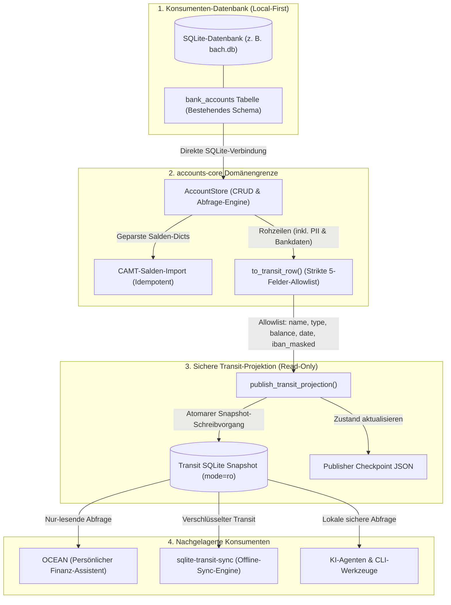
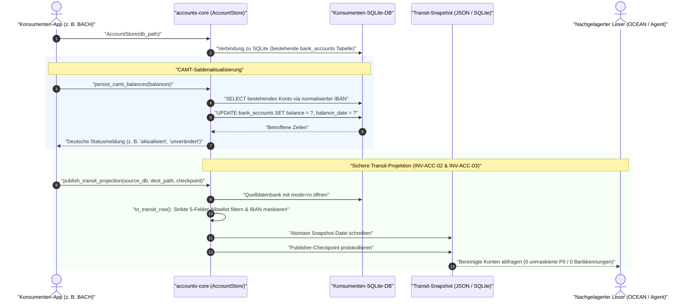

# accounts-core

[English](README.md) | [Deutsch](README_de.md)

<p align="center">
  <a href="pyproject.toml"></a>
  <a href="https://github.com/ellmos-ai/accounts-core/actions/workflows/ci.yml"></a>
  <a href="tests/"></a>
  <a href="pyproject.toml"></a>
  <a href="pyproject.toml"></a>
  <a href="SECURITY.md"></a>
  <a href="SECURITY.md"></a>
  <a href="https://github.com/astral-sh/ruff"></a>
  <a href="https://github.com/ellmos-ai"></a>
  <a href="https://github.com/open-bricks"></a>
  <a href="MARKETING-LOG.txt"></a>
  <a href="llms.txt"></a>
  <a href="LICENSE"></a>
</p>

Neutraler Fachkern für die Konten-/Kontostand-Domäne. Welle 1 liefert Bankkonten-CRUD,
CAMT-Salden-Import und eine **privacy-sichere, read-only Transit-Projektion** für andere
Konsumenten (z. B. OCEAN).

Aus [BACH](https://github.com/ellmos-ai/bach) extrahiert, damit BACH und OCEAN dieselben
Kontodaten über eine Implementierung lesen, statt dass BACH eine zweite, auseinanderdriftende
Kopie hält (Entscheidung D-20260903-003 = A, Analyse
`KONTEN-DOMAENE-OCEAN-ANALYSE_2026-09-03.md`). Gleiches Welle-1-Muster wie
[assistant-core](https://github.com/ellmos-ai/assistant-core) (D-20260830-002).

## Inhaltsverzeichnis

- [Visuelle Architektur](#visuelle-architektur)
- [Sequenz-Lebenszyklus](#sequenz-lebenszyklus)
- [Vertrag](#vertrag)
- [Privacy: die Transit-Projektion ist eine Allowlist, keine Denylist](#privacy-die-transit-projektion-ist-eine-allowlist-keine-denylist)
- [Governance & System-Invarianten](#governance--system-invarianten)
- [Installation](#installation)
- [Nutzung](#nutzung)
- [Ökosystem & Geschwister-Repositories](#ökosystem--geschwister-repositories)
- [Privacy (Modulgrenze)](#privacy-modulgrenze)
- [Projektstruktur](#projektstruktur)
- [Entwicklung](#entwicklung)
- [Lizenz](#lizenz)

## Visuelle Architektur



## Sequenz-Lebenszyklus



## Vertrag

- **Ein Datenkanon.** `AccountStore` bekommt den SQLite-Pfad des Konsumenten (BACH: `bach.db`)
  und arbeitet auf der vorhandenen Tabelle `bank_accounts`. Das Modul legt keine Tabellen an und
  hält keine eigenen Daten.
- **Kein UI-Toolkit, kein HTTP, kein XML-Parsing.** Konsumenten verdrahten Endpunkte gegen diese
  API und übergeben `persist_camt_balances` bereits geparste Salden-Dicts (die Form, die BACHs
  `CamtParser.parse_balances()` liefert) — das CAMT-Dateiformat bleibt eine BACH-seitige Sache.
- **Verhalten identisch zu BACH.** Jede SQL-Anweisung ist die, die BACH vor der Extraktion
  ausführte; nur die Aufrufstelle ist gewandert.
- **`credits` (Kredite) ist NICHT Teil von Welle 1.** Laut Analyse eine verwandte, aber eigene
  Domäne; bei Bedarf in einer späteren Welle ergänzen.

## Privacy: die Transit-Projektion ist eine Allowlist, keine Denylist

`AccountStore.transit_projection()` liefert **ausschließlich** `name`, `account_type`, `balance`,
`balance_date` und `iban_masked` (letzte 4 Zeichen, Rest durch `*` ersetzt). Keine Kontonummer,
kein BIC, kein Bankname, kein Inhabername, keine Notizen — und entscheidend: **kein Feld, das
`bank_accounts` später hinzugefügt wird, kann versehentlich durchsickern**: `to_transit_row()`
baut das Ergebnis, indem es die fünf erlaubten Felder ausdrücklich benennt, nie indem es Schlüssel
aus der Quellzeile entfernt. Eine Denylist vergisst die nächste Spalte, die jemand hinzufügt; eine
Allowlist kann das nicht. Siehe der Regressionstest
`test_to_transit_row_drops_bank_identifiers_and_unknown_columns`.

## Governance & System-Invarianten

Das Modul `accounts-core` erzwingt 8 verbindliche Architektur-Invarianten:

| Invariante | Bezeichnung | Spezifikation & Sicherheitsgarantie |
|---|---|---|
| `INV-ACC-01` | Zero Database Ownership | `AccountStore` legt keine Tabellen an und führt keine Migrationen durch; arbeitet ausschließlich auf der bestehenden `bank_accounts`-Tabelle des Konsumenten. |
| `INV-ACC-02` | Strikte Allowlist-Transit-Projektion | Transit-Projektion exportiert exakt 5 Felder: `name`, `account_type`, `balance`, `balance_date`, `iban_masked`. Ausschließlich Positivdefinition, kein Leck-Risiko. |
| `INV-ACC-03` | Maskierte IBAN-Garantie | Unmaskierte IBAN-Zeichenketten verlassen die Modulgrenze in Transit-Projektionen nie; strikt auf die letzten 4 Zeichen maskiert (`****3000`). |
| `INV-ACC-04` | Reines Local-First & Zero-Egress | Null externe Netzwerkaufrufe, keine Sockets, keine Telemetrie. 100% reine Standardbibliothek im unprivilegierten Nutzermodus (`RunAsInvoker`). |
| `INV-ACC-05` | Unveränderliche Quell-Isolation | Quell-SQLite-Datenbanken werden bei der Transit-Publikation mit explizitem `mode=ro` geöffnet. Quelle, Ziel und Checkpoint müssen 3 getrennte Pfade sein. |
| `INV-ACC-06` | Atomare Snapshot-Publikation | Snapshots werden in temporäre Zwischendateien geschrieben und atomar umbenannt, um unvollständiges Lesen durch nachgelagerte Konsumenten auszuschließen. |
| `INV-ACC-07` | Idempotenter CAMT-Salden-Import | Saldenabgleich erfolgt strikt über normalisierte IBANs; liefert deterministische deutsche UTF-8-Erfolgsmeldungen (`aktualisiert`, `unverändert`). |
| `INV-ACC-08` | Deterministische Fail-Closed Fehlerbehandlung | Typisierte Ausnahmen (`FileNotFoundError`, `ValueError`) bei ungültigen Pfaden oder Schema-Verstößen; kein stilles Degradieren. |

## Installation

```bash
pip install -e .            # in der Umgebung des Konsumenten
pip install -e ".[dev]"     # zusätzlich pytest und ruff
```

Python 3.10+, keine Laufzeit-Abhängigkeiten.

## Nutzung

```python
from accounts_core import AccountStore

store = AccountStore("/pfad/zu/bach.db")          # oder default_db_path() -> BACH_DB-Env
account_id = store.create_account("Girokonto", bank_name="Sparkasse", iban="DE89...", bic="...")
store.list_accounts()
store.update_account(account_id, "Neuer Name", bank_name="Sparkasse")
store.delete_account(account_id)

# CAMT-Import: bereits geparste Salden übergeben (Form von BACHs CamtParser.parse_balances())
store.persist_camt_balances([{"iban": "DE89...", "balance": 1234.56, "currency": "EUR", "date": "2026-09-01"}])

# Read-only Projektion für andere Konsumenten (OCEAN via sqlite-transit-sync, Welle 3)
store.transit_projection()
# -> [{"name": "Girokonto", "account_type": "girokonto", "balance": 1234.56,
#      "balance_date": "2026-09-01", "iban_masked": "*"*18 + "3000"}]
```

Welle 3 veröffentlicht dieselbe Allowlist als separate, geschlossene
SQLite-Datei für `sqlite-transit-sync` und OCEAN. Die Quelldatenbank wird nur
lesend geöffnet; Quelle, Projektion und Publisher-Checkpoint müssen drei
verschiedene Pfade sein.

```python
from accounts_core import publish_transit_projection

publish_transit_projection(
    "/pfad/zu/bach.db",
    "/pfad/zu/transit/accounts.sqlite",
    "/pfad/zu/state/accounts-publisher.json",
    publisher_instance="bach-primary",
)
```

Die Ausgabe erfüllt `org.ellmos.accounts.balance-projection` v1.0.0 und ist ein
vollständiger Ersatz-Snapshot: Konsumenten verifizieren ihn und ersetzen danach
ihre bisherige read-only Sicht. Quell-ID und unmaskierte Bankkennungen werden
nicht geschrieben.

`persist_camt_balances()` liefert deutsche UTF-8-Ergebnismeldungen mit echten Umlauten, etwa
`unverändert` und `übersprungen`.

## Ökosystem & Geschwister-Repositories

`accounts-core` ist ein zentraler Domänen-Baustein im Ökosystem von `ellmos-ai` und `open-bricks`:

| Repository | Rolle im Ökosystem | Integrationspunkt |
|---|---|---|
| [bach](https://github.com/ellmos-ai/bach) | Primärer Finanz-Monolith / Konsument | Quelle für Kontodaten (`bach.db`), Auslöser des CAMT-Imports |
| [sqlite-transit-sync](https://github.com/ellmos-ai/sqlite-transit-sync) | Offline-SQLite-Sync-Engine | Überträgt schreibgeschützte Konten-Snapshots zwischen Systemen |
| [assistant-core](https://github.com/ellmos-ai/assistant-core) | Fachkern für LLM-Assistentenzustand | Schwestermodul mit identischem Welle-1-Architekturmuster |
| [open-ocean](https://github.com/ellmos-ai/open-ocean) | Lokaler Finanz- & Budget-Begleiter | Nachgelagerter Konsument für bereinigte Konten-Snapshots |
| [report-forge](https://github.com/ellmos-ai/report-forge) | Deterministische Reporting-Engine | Generiert Kontoauszüge & Finanzberichte aus Snapshots |
| [open-bricks](https://github.com/open-bricks) | Dachorganisation für Open Source | Architektur-Governance, Standardisierung und Paketierung |

## Privacy (Modulgrenze)

Arbeitet nur auf dem übergebenen Datenbankpfad. Kein Netzwerk, keine Telemetrie, keine eigenen
Dateien. Bank-Stammdaten (Kontonummer, BIC, Inhabername) verlassen das Modul über die
Transit-Projektion nie — siehe Allowlist-Abschnitt oben.

## Projektstruktur

```
src/accounts_core/accounts.py    AccountStore, Transit-Projektion, CAMT-Salden-Persistenz
src/accounts_core/__init__.py    Öffentliche API-Exporte und Modulversion
tests/test_accounts.py           Verhalten gegen die exakte BACH-bank_accounts-DDL
tests/test_metadata.py           Vertragstests für Metadaten, Security SLAs, CI und Parität
MARKETING-LOG.txt                Personas, Discoverability-Keywords und Integrations-Blueprints
THIRD_PARTY_LICENSES.md         Pure stdlib Zero-Runtime-Dependency-Inventar (PEP 639)
TODO.md                          Standardisierter Aufgaben-Tracker mit STATUS-Tabelle & Release-Gates
SECURITY.md                      Zweisprachige Sicherheitsrichtlinie mit 48h-SLA & 5-Tage-Triage
llms.txt                         Maschinenlesbares LLM-Kontextdokument
ellmos-module.v2.json            Modul-Manifest für den ellmos-Modulkatalog
```

## Entwicklung

```bash
pytest -ra -v
python -m ruff check src tests
python -m compileall -q src tests
```

## Lizenz

MIT-Lizenz. Siehe [LICENSE](LICENSE) und [THIRD_PARTY_LICENSES.md](THIRD_PARTY_LICENSES.md). Kanonisches Repository: `ellmos-ai/accounts-core` (privat).
